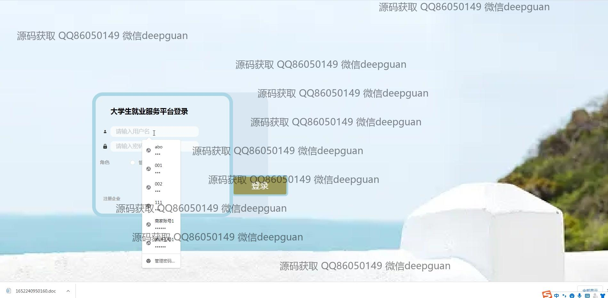
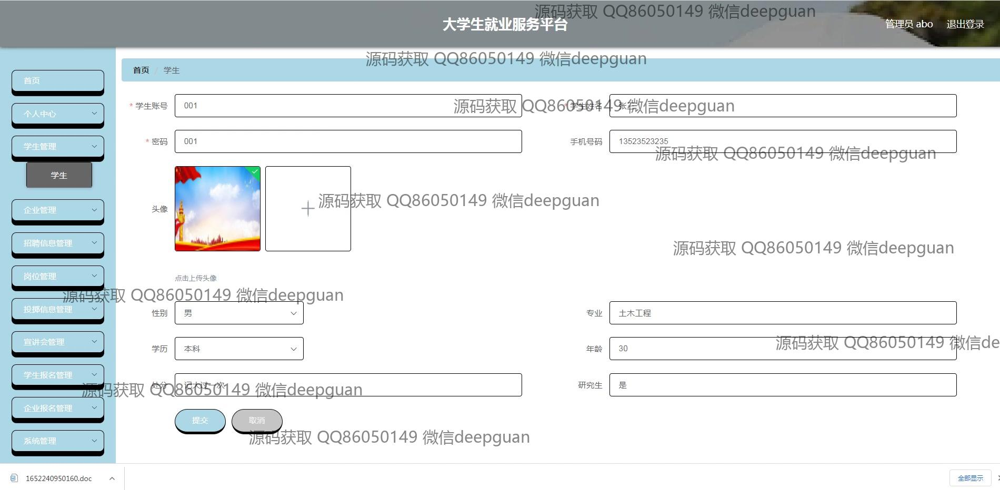
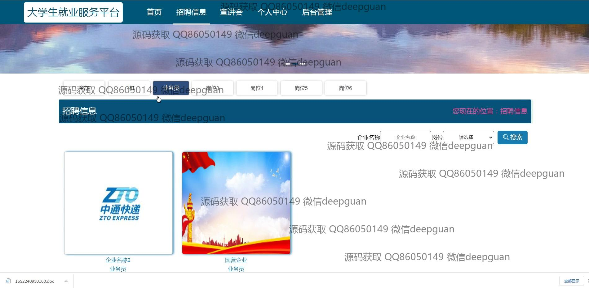
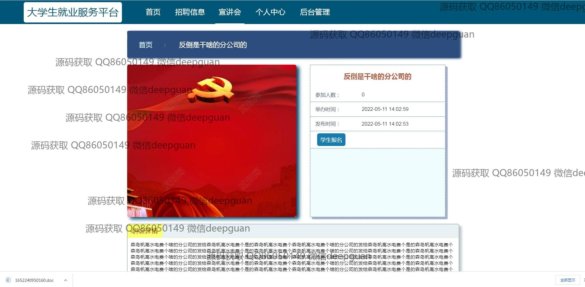
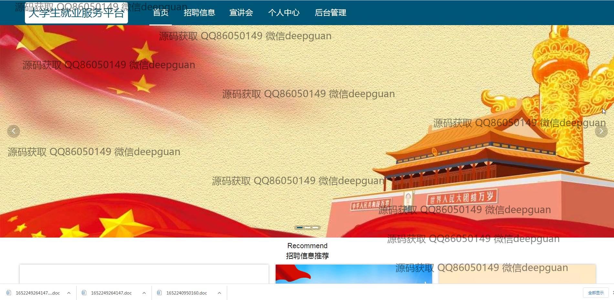

<h1 align="center">大学生就业服务平台</h1>

## 简介
大学生就业服务平台：角色分为管理员、企业、学生；实现企业注册、岗位管理、招聘信息管理、投递信息管理、宣讲会管理及个人中心等功能，优化求职和招聘流程，提高就业服务效率。    --计算机毕业设计源码；毕设源码；java毕业设计源码

## 联系方式

<h3 align="center">获取完整代码与数据库文件 + 微信：deepguan QQ: 86050149 QQ群: 783742310</h3>

<h3 align="center">可帮忙远程部署 包运行成功！提供远程部署、修改代码、设计文档指导、代码讲解等服务！</h3>

## 功能介绍（完整见运行截图）
管理员：基本功能包括登录、注册和退出，提供网站主页的主要导航栏、招聘信息管理和投递信息管理。管理员可以在后台对用户角色进行管理，包括学生和企业的审核、信息统计分析。可通过功能菜单管理企业报名、宣讲会、以及更新网站的各类信息。   
学生：可通过个人中心查看和修改个人信息，上传和管理简历，参加宣讲会和企业招聘。网站提供职位搜索和申请功能，以及个性化推荐帮助学生获取就业信息。学生在系统可浏览招聘信息、参加活动报名和获取面试通知。   
企业：企业用户需完成注册以发布招聘信息，并可通过平台管理招聘流程，查看学生投递详情以及进行企业招生活动。可使用岗位管理模块管理企业招聘职位，优化招聘效率。   
用户：可以在个人中心查看个人信息和修改密码，访问并使用平台提供的就业信息与服务。用户通过搜索和菜单导航快速访问不同模块以便于管理和参与相关服务。

## 运行截图

本代码来源于网络,仅供学习参考使用!

